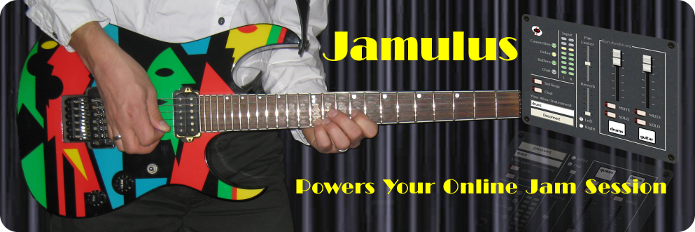

Jamulus - Internet Jam Session Software
=======================================

The Jamulus software enables musicians to perform real-time jam sessions over the internet.
There is one server running the Jamulus server software which collects the audio data from
each Jamulus client, mixes the audio data and sends the mix back to each client.

Jamulus is [__free and open source software__](https://www.gnu.org/philosophy/free-sw.en.html) (FOSS) licensed under the [GPL](http://www.gnu.org/licenses/gpl-2.0.html) 
and runs under __Windows__ ([ASIO](https://www.steinberg.net)),
__MacOS__ ([Core Audio](https://developer.apple.com/documentation/coreaudio)) and
__Linux__ ([Jack](https://jackaudio.org)).
It is based on the [Qt framework](https://www.qt.io) and uses the [OPUS](http://www.opus-codec.org) audio codec.

The project is hosted at [Sourceforge.net](https://sourceforge.net/projects/llcon).

Installation
------------

[Please see the Getting Started page](https://jamulus.io/wiki/Getting-Started) containing instructions for installing and using Jamulus for your platform.

Help
----

Official documentation for Jamulus is on the [Jamulus homepage](https://jamulus.io)

See also the [discussion forums](https://sourceforge.net/p/llcon/discussion). If you have issues, feel free to ask for help there.

Bugs and feature requests can be [reported here](https://github.com/jamulussoftware/jamulus/issues)

Compilation
-----------

[Please see these instructions](https://jamulus.io/wiki/Compiling)

Contributing
------------

See the [contributing instructions](CONTRIBUTING.md)

Acknowledgments
---------------

This code contains open source code from different sources. The developer(s) want
to thank the developer of this code for making their efforts available under open
source:

- Qt cross-platform application framework: http://www.qt.io

- Opus Interactive Audio Codec: http://www.opus-codec.org

- Audio reverberation code: by Perry R. Cook and Gary P. Scavone, 1995 - 2004
  (taken from "The Synthesis ToolKit in C++ (STK)"):
  http://ccrma.stanford.edu/software/stk
  
- Some pixmaps are from the Open Clip Art Library (OCAL): http://openclipart.org

- Country flag icons from Mark James: http://www.famfamfam.com

We would also like to acknowledge the contributors listed in the
[Github Contributors list](https://github.com/jamulussoftware/jamulus/graphs/contributors).
