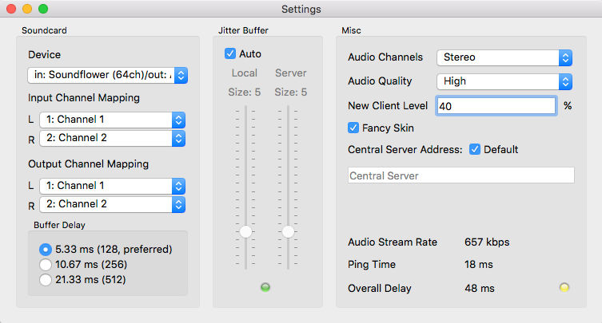
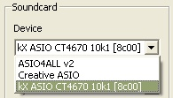
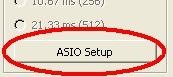
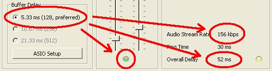

 #### (https://travis-ci.org/braindef/jamulus/builds)

Jamulus - Internet Jam Session Software
=======================================

The Jamulus software enables musicians to perform real-time jam sessions over the internet.
There is one server running the Jamulus server software which collects the audio data from
each Jamulus client, mixes the audio data and sends the mix back to each client.

Jamulus is __Open Source software__ ([GPL, GNU General Public License](http://www.gnu.org/licenses/gpl-2.0.html))
and runs under __Windows__ ([ASIO](http://www.steinberg.net)),
__MacOS__ ([Core Audio](http://developer.apple.com/technologies/mac/audio-and-video.html)) and
__Linux__ ([Jack](http://jackaudio.org)).
It is based on the [Qt framework](https://www.qt.io) and uses the [OPUS](http://www.opus-codec.org) audio codec.

The source code is hosted at [Sourceforge.net](http://sourceforge.net/projects/llcon).

Required Hardware Setup
-----------------------

The required minimum internet connection speed is 200 kbps for the up- and downstream.
The ping time (i.e. round trip delay) from your computer to the server should not exceed 40 ms average.

For the Jamulus software to run stable it is recommended to use a PC with at least 1.5 GHz CPU frequency.

On a Windows operating system it is recommended to use a sound card with a native ASIO driver.
This ensures to get the lowest possible latencies.

Windows Download and Installation
---------------------------------

[Download](http://sourceforge.net/projects/llcon/files) a Windows installer at the
Sourceforge.net download page

The Jamulus software requires an ASIO sound card driver to be
available in the system. If your sound card does not have native
ASIO support, you can try out the following alternative:
[ASIO4ALL - Universal ASIO Driver For WDM Audio](http://www.asio4all.com)

The ASIO buffer size should be selected as low as possible to get
the minimum audio latency (a good choice is 128 samples).

Help (Software Manual)
----------------------

### Main Window

#### Status LEDs

The Delay status LED indicator shows the current audio delay status. If the light is green, the delay
is perfect for a jam session. If the ligth is yellow, a session is still possible but it may be harder
to play. If the light is red, the delay is too large for jamming.

The Buffer status LED indicator shows the current audio/streaming status. If the light is green, there
are no buffer overruns/underruns and the audio stream is not interrupted. If the light is red, the
audio stream is interrupted caused by one of the following problems:

- The network jitter buffer is not large enough for the current network/audio interface jitter.
- The sound card buffer delay (buffer size) is set to a too small value.
- The upload or download stream rate is too high for the current available internet bandwidth.
- The CPU of the client or server is at 100%.

#### Input level

The input level indicators show the input level of the two stereo channels of the current selected audio input.
Make sure not to clip the input signal to avoid distortions of the audio signal.

#### Chat button opens the Chat dialog

Press the Chat button to open the Chat dialog. The chat text entered in that dialog is transmitted to
all connected clients. If a new chat message arrives and the Chat dialog is not already open, it will
be opened automatically at all clients.

#### My Profile button opens the Musician Profile dialog

Press the My Profile button to open the Musician Profile dialog. In this dialog you can set your Alias/Name
which is displayed below your fader in the server audio mixer board. If an instrument and/or country is set,
icons for these selection will also be shown below your fader. The skill setting changes the background of
the fader tag and the city entry shows up in the tool tip of the fader tag. This tool tip is shown in the following picture.

#### Connect/disconnect button

Push this button to connect a server. A dialog where you can select a server will open. If you are connected,
pressing this button will end the session.

The server list shows a list of available servers which are registered at the central server. Select a server
from the list and press the connect button to connect to this server. Alternatively, double click a server from
the list to connect to it. If a server is occupied, a list of the connected musicians is available by expanding
the list item. Permanent servers are shown in bold font.

Note that it may take some time to retrieve the server list from the central server. If no valid central server
address is specified in the settings, no server list will be available.

Alternatively, you can enter an IP address or URL of the server running the Jamulus server in the server address
field. An optional port number can be added after the IP address or URL using a comma as a separator, e.g,
jamulus.dyndns.org:22124. A list of the most recent used server IP addresses or URLs is available for selection.

#### Reverberation effect

A reverberation effect can be applied to one local mono audio channel or to both channels in stereo mode.
The mono channel selection and the reverberation level can be modified. If, e.g., the microphone signal is fed
into the right audio channel of the sound card and a reverberation effect shall be applied, set the channel selector
to right and move the fader upwards until the desired reverberation level is reached.

The reverberation effect requires significant CPU so that it should only be used on fast PCs. If the reverberation
level fader is set to minimum (which is the default setting), the reverberation effect is switched off and does
not cause any additional CPU usage.

#### Local audio input fader

With the audio fader, the relative levels of the left and right local audio channels can be changed. For a mono signal
it acts like a panning between the two channels. If, e.g., a microphone is connected to the right input channel and
an instrument is connected to the left input channel which is much louder than the microphone, move the audio fader
in a direction where the label above the fader shows L -x, where x is the current attenuation indicator.

#### Server audio mixer

In the audio mixer frame, a fader for each connected client at the server is shown. This includes a fader for the own signal.
With the faders, the audio level of each client can be modified individually.

With the Mute checkbox, the current audio channel can be muted. With the Solo checkbox, the current audio channel can
be set to solo which means that all other channels except of the current channel are muted.

### Settings Window

#### Sound card device

The ASIO driver (sound card) can be selected using Jamulus under the Windows operating system. If the selected ASIO
driver is not valid an error message is shown and the previous valid driver is selected. Under the Mac operating
system the input and output hardware can be selected.

#### Input/output channel mapping

In case the selected sound card device offers more than one input or output channel, the _Input Channel Mapping
and Ouptut Channel Mapping_ settings are visible. For each Jamulus input/output channel (left and right channel)
a different actual sound card channel can be selected.

#### Buffer delay

The buffer delay setting is a fundamental setting of the Jamulus software. This setting has influence on many
connection properties. Three buffer sizes are supported:

- 128 samples: This is the preferred setting since it gives lowest latency but does not work with all sound cards.
- 256 samples: This setting should work on most of the available sound cards.
- 512 samples: This setting should only be used if only a very slow computer or a slow internet connection is available.

Some sound card driver do not allow the buffer delay to be changed from within the Jamulus software.
In this case the buffer delay setting is disabled. To change the actual buffer delay,
this setting has to be changed in the sound card driver. On Windows, press the ASIO Setup button to open
the driver settings panel.

On Linux, use the Jack configuration tool to change the buffer size.

The actual buffer delay has influence on the connection status, the current upload rate and the overall delay.
The lower the buffer size, the higher the probability of red light in the status indicator (drop outs) and the
higher the upload rate and the lower the overall delay.

The buffer setting is therefore a trade-off between audio quality and overall delay.

#### Jitter buffer with buffer status indicator

The jitter buffer compensates for network and sound card timing jitters. The size of this jitter buffer has
therefore influence on the quality of the audio stream (how many dropouts occur) and the overall delay
(the longer the buffer, the higher the delay).

The jitter buffer size can be manually chosen for the local client and the remote server. For the local jitter
buffer, dropouts in the audio stream are indicated by the light on the bottom of the jitter buffer size faders.
If the light turns to red, a buffer overrun/underrun took place and the audio stream is interrupted.

The jitter buffer setting is therefore a trade-off between audio quality and overall delay.

An auto setting of the jitter buffer size setting is available. If the check Auto is enabled, the jitter buffers
of the local client and the remote server are set automatically based on measurements of the network and sound card
timing jitter. If the Auto check is enabled, the jitter buffer size faders are disabled (they cannot be moved with the mouse).

#### Audio channels

Select the number of audio channels to be used. There are three modes available. The mono and stereo modes use one
and two audio channels respectively. In the mono-in/stereo-out mode the audio signal which is sent to the server is
mono but the return signal is stereo. This is useful for the case that the sound card puts the instrument on one
input channel and the microphone on the other channel. In that case the two input signals can be mixed to one mono
channel but the server mix can be heard in stereo.

Enabling the stereo streaming mode will increase the stream data rate. Make sure that the current upload rate does
not exceed the available bandwidth of your internet connection.

In case of the stereo streaming mode, no audio channel selection for the reverberation effect will be available on
the main window since the effect is applied on both channels in this case.

#### Audio quality

Select the desired audio quality. A low, normal or high audio quality can be selected. The higher the audio quality,
the higher the audio stream data rate. Make sure that the current upload rate does not exceed the available bandwidth
of your internet connection.

#### New client level

The new client level setting defines the fader level of a new connected client in percent. I.e. if a new client connects
to the current server, it will get the specified initial fader level if no other fader level of a previous connection of
that client was already stored.

#### Fancy skin

If enabled, a fancy skin will be applied to the main window.

#### Central server address

The central server address is the IP address or URL of the central server at which the server list of the connection
dialog is managed. If the Default check box is checked, the default central server address is shown read-only.

#### Current connection status parameter

The ping time is the time required for the audio stream to travel from the client to the server and backwards.
This delay is introduced by the network. This delay should be as low as 20-30 ms. If this delay is higher (e.g., 50-60 ms),
your distance to the server is too large or your internet connection is not sufficient.

The overall delay is calculated from the current ping time and the delay which is introduced by the current buffer settings.

The upstream rate depends on the current audio packet size and the audio compression setting. Make sure that the upstream
rate is not higher than the available rate (check the upstream capabilities of your internet connection by, e.g., using
[speedtest.net](http://speedtest.net)). 

### Server

#### Jamulus server requirements

The minimum internet connection speed for the server is 1 Mbps for up- and downstream and a very low ping time.
It is recommended to have at least 1.6 GHz CPU frequency and 1 GB RAM.
The Jamulus server can be run on all supported operating systems (Windows, MacOS and Linux). 

#### Using Windows OS

After installing Jamulus you find a link to the server in the Windows start menu (or "All apps" under Windows 8).
When starting the server it automatically registers at the official central server. Just type in the name,
city and country so that other users can easily identify your server.

If you want the server to be started automatically on each Windows start, enable the corresponding check box.
If you do not want to register your server at the official central server (so that it does not show up in the
server list of jamulus.dyndns.org) uncheck the "Register" check box.

#### Using a Linux shell

If the server shall be started from within an ssh shell, there is a command line option

`./Jamulus -s -n`

available which starts the server without a GUI (even though the GUI is not used, QT must still be installed on the
server to run the Jamulus server software). 

Compilation and Development
---------------------------

See the [Compile Instructions](INSTALL.md) file.

Acknowledgments
---------------

This code contains open source code from different sources. The developer(s) want
to thank the developer of this code for making their efforts available under open
source:

- Qt cross-platform application framework: http://qt-project.org

- Opus Interactive Audio Codec: http://www.opus-codec.org

- Audio reverberation code: by Perry R. Cook and Gary P. Scavone, 1995 - 2004
  (taken from "The Synthesis ToolKit in C++ (STK)"):
  http://ccrma.stanford.edu/software/stk
  
- Some pixmaps are from the Open Clip Art Library (OCAL): http://openclipart.org

- Audio recording for the server and SVG history graph, coded by [pljones](http://github.com/pljones): http://jamulus.drealm.info
