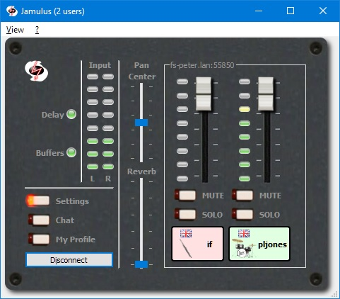

Jamulus - Internet Jam Session Software
=======================================

The Jamulus software enables musicians to perform real-time jam sessions over the internet.
There is one server running the Jamulus server software which collects the audio data from
each Jamulus client, mixes the audio data and sends the mix back to each client.

Jamulus is __Open Source software__ ([GPL, GNU General Public License](http://www.gnu.org/licenses/gpl-2.0.html))
and runs under __Windows__ ([ASIO](http://www.steinberg.net)),
__MacOS__ ([Core Audio](http://developer.apple.com/technologies/mac/audio-and-video.html)) and
__Linux__ ([Jack](http://jackaudio.org)).
It is based on the [Qt framework](https://www.qt.io) and uses the [OPUS](http://www.opus-codec.org) audio codec.

The source code is hosted at [Sourceforge.net](http://sourceforge.net/projects/llcon).

Required Hardware Setup
-----------------------

The required minimum internet connection speed is 200 kbps for the up- and downstream.
The ping time (i.e. round trip delay) from your computer to the server should not exceed 40 ms average.

For the Jamulus software to run stable it is recommended to use a PC with at least 1.5 GHz CPU frequency.

On a Windows operating system it is recommended to use a sound card with a native ASIO driver.
This ensures to get the lowest possible latencies.

Windows Download and Installation
---------------------------------

[Download](http://sourceforge.net/projects/llcon/files) a Windows installer at the
Sourceforge.net download page

The Jamulus software requires an ASIO sound card driver to be
available in the system. If your sound card does not have native
ASIO support, you can try out the following alternative:
[ASIO4ALL - Universal ASIO Driver For WDM Audio](http://www.asio4all.com)

The ASIO buffer size should be selected as low as possible to get
the minimum audio latency (a good choice is 128 samples). 

Help (Software Manual)
----------------------

### Main Window

#### Status LEDs

The Delay status LED indicator shows the current audio delay status. If the light is green, the delay
is perfect for a jam session. If the ligth is yellow, a session is still possible but it may be harder
to play. If the light is red, the delay is too large for jamming.

The Buffer status LED indicator shows the current audio/streaming status. If the light is green, there
are no buffer overruns/underruns and the audio stream is not interrupted. If the light is red, the
audio stream is interrupted caused by one of the following problems:

- The network jitter buffer is not large enough for the current network/audio interface jitter.
- The sound card buffer delay (buffer size) is set to a too small value.
- The upload or download stream rate is too high for the current available internet bandwidth.
- The CPU of the client or server is at 100%.

#### Input level

The input level indicators show the input level of the two stereo channels of the current selected audio input.
Make sure not to clip the input signal to avoid distortions of the audio signal. 

#### Chat button opens the Chat dialog

Press the Chat button to open the Chat dialog. The chat text entered in that dialog is transmitted to
all connected clients. If a new chat message arrives and the Chat dialog is not already open, it will
be opened automatically at all clients. 

Compilation and Development
---------------------------

See the [Compile Instructions](INSTALL.md) file.

Acknowledgments
---------------

This code contains open source code from different sources. The developer(s) want
to thank the developer of this code for making their efforts available under open
source:

- Qt cross-platform application framework: http://qt-project.org

- Opus Interactive Audio Codec: http://www.opus-codec.org

- Audio reverberation code: by Perry R. Cook and Gary P. Scavone, 1995 - 2004
  (taken from "The Synthesis ToolKit in C++ (STK)"):
  http://ccrma.stanford.edu/software/stk
  
- Some pixmaps are from the Open Clip Art Library (OCAL): http://openclipart.org

- Audio recording for the server and SVG history graph, coded by [pljones](http://github.com/pljones): http://jamulus.drealm.info
