( en | [es](https://github.com/corrados/jamulus/blob/master/src/res/homepage/ES/manual-es.md) )

Jamulus Help (Software Manual)
==============================

Main Window
-----------

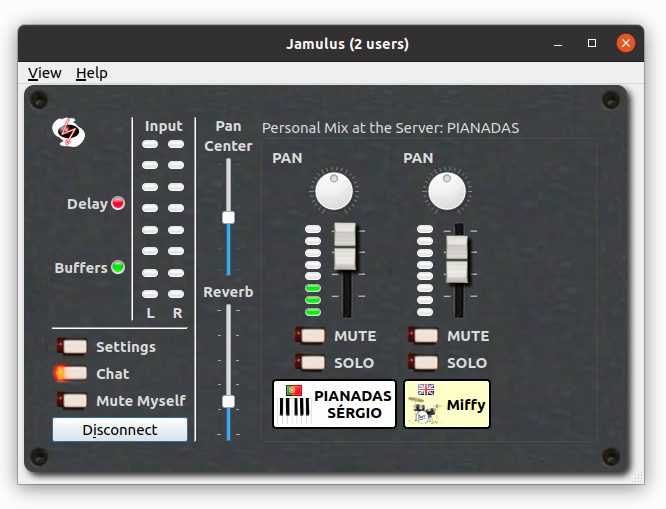

### Status LEDs

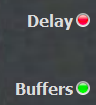

The **Delay Status** LED shows the current audio delay status:

* **Green** - The delay is perfect for a jam session

* **Yellow** - A session is still possible but it may be harder to play

* **Red** - The delay is too large for jamming

**Buffers** shows the current audio/streaming status. If the light is **red**, the audio stream is interrupted. This is caused by one of the following problems:

- The network jitter buffer is not large enough for the current network/audio interface jitter.
- The sound card's buffer delay (buffer size) is too small (see Settings window).
- The upload or download stream rate is too high for your internet bandwidth.
- The CPU of the client or server is at 100%.

### Input level

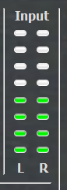

This shows the level of the two stereo channels for your audio input.
Make sure not to clip the input signal to avoid distortions of the audio signal (the LEDs will indicate clipping when it occurs).

### Chat button

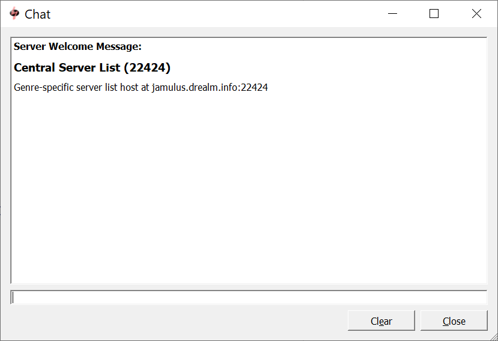

The chat text entered in that dialog is sent to
all connected clients. If a new chat message arrives and the Chat dialog is not already open, it will
opened automatically for all clients.

### Profile window

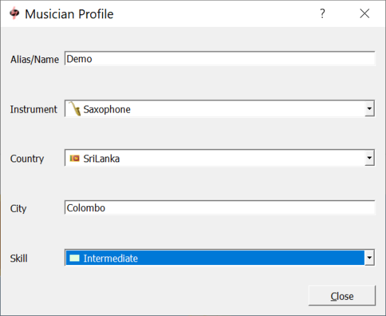

From the View menu, select My Profile... to set your Alias/Name
which is displayed below your fader in the server audio mixer board. If an instrument and/or country is set,
icons for these selections will also be shown below your fader. The skill setting changes the background colour of
the fader tag and the city entry shows up in the tool tip of the fader tag (see screenshot below).

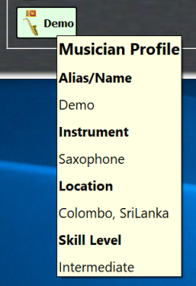

### Connect/disconnect button

Opens a dialog where you can select a server to connect to. If you are connected,
pressing this button will end the session.

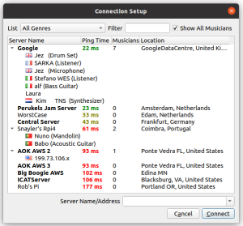

The Connection Setup window shows a list of available servers together with the number of occupants and the maxmium number supported. Server operators can optionally list their servers by musical genre. Use the List dropdown to select a genre, click on the server you want to join and press the Connect button to connect to it. Alternatively, double-click on the server name. Permanent servers (those that have been listed for longer than 24 hours) are shown in bold.

You can filter the list by server name or location. To list only occupied servers, enter a "#" character.

If you know the IP address or URL of a server, you can connect to it using the Server Name/Address
field. An optional port number can be added after the IP address or URL using a colon as a separator, e.g,
jamulus.dyndns.org:22124. The field will also show a list of the most recently used server addresses.

### Mute Myself button

Cuts your audio stream to the server so that you will be able to hear yourself and see your own input levels, but other musicians will not. Be aware that other musicians will not know if you have muted yourself.

### Reverb effect

Reverb can be applied to one local mono audio channel or to both channels in stereo mode.
The mono channel selection and the reverberation level can be modified. For example, if a microphone signal is fed
in to the right audio channel of the sound card and a reverb effect needs to be applied, set the channel selector
to the right and move the fader upwards until the desired reverb level is reached.

### Local audio pan / balance control

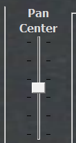

Controls the relative levels of the left and right local audio channels. For a mono signal
it acts as a pan between the two channels. For example, if a microphone is connected to the right input channel and
an instrument is connected to the left input channel which is much louder than the microphone, move the audio fader
in a direction where the label above the fader shows L -x, where x is the current attenuation indicator.

### Server audio mixer

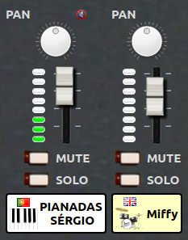

In the audio mixer frame, a fader is shown for each connected client at the server (including yourself).
The faders allow you to adjust the level of what you hear without affecting what others hear.

The VU meter shows the input level at the server - that is, the sound being sent.

If you have set your Audio Channel to Stereo or Stereo Out in your Settings, you will also see a pan control. 

If you see a "mute" icon above a channel, it means that musician cannot hear you. Either they have muted you, soloed one or more channels not including yours, or have set your fader in their mix to zero.

Using the **Mute button** prevents the indicated channel being heard in your local mix. Be aware that when you mute a musician, they will see a "muted" icon above your fader to indicate that you cannot hear them. Note also that you will continue to see their VU meters moving if sound from the muted musician is reaching the server. Your fader position for them is also unaffected.

The **Solo button** allows you to hear one or more musicians on their own. Those not soloed will be muted. Note also that those musicians who are not soloed will see a "muted" icon above your fader.

Channels are listed left to right in the order that clients connect until they leave, at which point their "slot" is filled by the next new arrival. You can change the sort order using the Edit option in the application menu.

You can group faders together using the "group" toggle. Moving the fader of any member of the group will move the other faders in that group by the same amount.

If the server operator has enabled recording, you will see a message above the mixer showing that you are being recorded. 

Settings Window
---------------

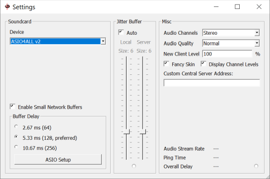

### Sound card device

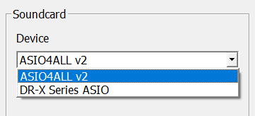

The ASIO driver (sound card) can be selected using Jamulus under the Windows operating system. If the selected ASIO
driver is not valid an error message is shown and the previous valid driver is selected. Under the Mac operating
system the input and output hardware can be selected.

### Input/output channel mapping

If the selected sound card device offers more than one input or output channel, the _Input Channel Mapping
and Output Channel Mapping_ settings are visible. For each Jamulus input/output channel (left and right channel)
a different actual sound card channel can be selected.

### Enable small network buffers

Allows support for very small network audio packets. These are only used if the sound card buffer delay is smaller than 128 samples. The smaller the network buffers, the
lower the audio latency. But at the same time the network load increases and the probability of audio dropouts
also increases.

### Buffer delay

The buffer delay setting is a fundamental setting of the Jamulus software. This setting has an influence on many
connection properties. Three buffer sizes are supported:

- 64 samples: The preferred setting. Provides the lowest latency but does not work with all sound cards.
- 128 samples: Should work for most available sound cards.
- 256 samples: Should only be used on very slow computers, or with a slow internet connection.

Some sound card drivers do not allow the buffer delay to be changed from within the Jamulus software.
In this case the buffer delay setting is disabled and has to be changed using the sound card driver. On Windows, press the ASIO Setup button to open the driver settings panel.

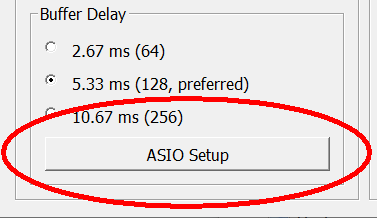

On Linux, use the Jack configuration tool to change the buffer size.

The actual buffer delay has influence on the connection status, the current upload rate and the overall delay.
The lower the buffer size, the higher the probability of a red light in the status indicator (drop outs) and the
higher the upload rate and the lower the overall delay.

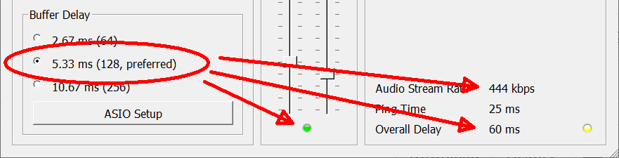

The buffer setting is therefore a trade-off between audio quality and overall delay.

### Jitter buffer with buffer status indicator

The jitter buffer compensates for network and sound card timing jitters. The size of the buffer
therefore influences the quality of the audio stream (how many dropouts occur) and the overall delay
(the longer the buffer, the higher the delay).

You can set the jitter buffer size manually for the local client and the remote server. For the local jitter
buffer, dropouts in the audio stream are indicated by the light below the jitter buffer size faders.
If the light turns to red, a buffer overrun/underrun has taken place and the audio stream is interrupted.

The jitter buffer setting is therefore a trade-off between audio quality and overall delay.

If the Auto setting is enabled, the jitter buffers
of the local client and the remote server are set automatically based on measurements of the network and sound card
timing jitter. If the Auto check is enabled, the jitter buffer size faders are disabled (they cannot be moved with the mouse).

### Audio channels

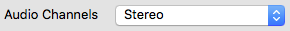

Selects the number of audio channels to be used for communication between client and server. There are three modes
available:

Mono and Stereo modes use one and two audio channels respectively.

Mono-in/Stereo-out: The audio signal sent to the server is mono but the return signal is stereo. This is useful if the sound card has the instrument on one input channel and the microphone on the other. In that case
the two input signals can be mixed to one mono channel but the server mix is heard in stereo.

Enabling stereo mode will increase your stream's data rate. Make sure your upload rate does
not exceed the available upload speed of your internet connection.

In stereo streaming mode, no audio channel selection for the reverb effect will be available on
the main window since the effect is applied to both channels in this case.

### Audio quality

The higher the audio quality, the higher your audio stream's data rate. Make sure your upload rate does not exceed the available upload speed of your internet connection.

### New client level

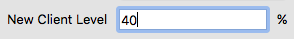

This setting defines the fader level of a newly connected client in percent. If a new musician connects
to the current server, they will get the specified initial fader level if no other fader level from a previous connection of
that client was already stored.

### Fancy skin

This applies a fancy skin to the main window.

### Custom central server address

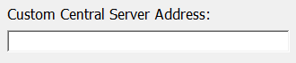

Leave this blank unless you need to enter the address of a central server other than the default.

### Current connection status parameter

The Ping Time is the time required for the audio stream to travel from the client to the server and back again.
This delay is introduced by the network and should about 20-30ms. If this delay is higher than about 50ms,
your distance to the server is too large or your internet connection is not sufficient.

Overall Delay is calculated from the current Ping Time and the delay introduced by the current buffer settings.

Audio Upstream Rate depends on the current audio packet size and compression setting. Make sure that the upstream
rate is not higher than your available internet upload speed (check this with a service such as [speedtest.net](http://speedtest.net)).
