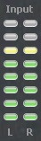
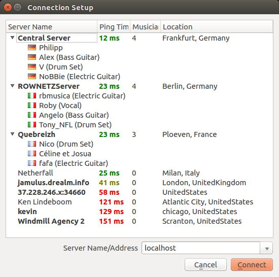
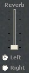
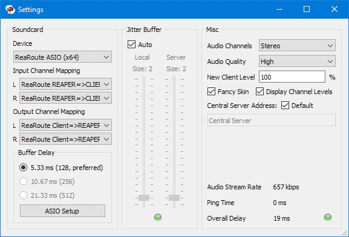
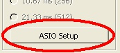
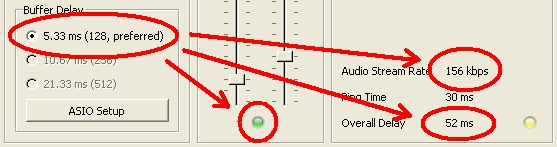

Jamulus Help (Software Manual)
==============================

Main Window
-----------

### Status LEDs

The Delay status LED indicator shows the current audio delay status. If the light is green, the delay
is perfect for a jam session. If the light is yellow, a session is still possible but it may be harder
to play. If the light is red, the delay is too large for jamming.

The Buffer status LED indicator shows the current audio/streaming status. If the light is green, there
are no buffer overruns/underruns and the audio stream is not interrupted. If the light is red, the
audio stream is interrupted caused by one of the following problems:

- The network jitter buffer is not large enough for the current network/audio interface jitter.
- The sound card buffer delay (buffer size) is set to a too small value.
- The upload or download stream rate is too high for the current available internet bandwidth.
- The CPU of the client or server is at 100%.

### Input level

The input level indicators show the input level of the two stereo channels of the current selected audio input.
Make sure not to clip the input signal to avoid distortions of the audio signal.

### Chat button opens the Chat dialog

Press the Chat button to open the Chat dialog. The chat text entered in that dialog is transmitted to
all connected clients. If a new chat message arrives and the Chat dialog is not already open, it will
be opened automatically at all clients.

### My Profile button opens the Musician Profile dialog

Press the My Profile button to open the Musician Profile dialog. In this dialog you can set your Alias/Name
which is displayed below your fader in the server audio mixer board. If an instrument and/or country is set,
icons for these selections will also be shown below your fader. The skill setting changes the background of
the fader tag and the city entry shows up in the tool tip of the fader tag. This tool tip is shown in the following picture.

### Connect/disconnect button

Push this button to connect a server. A dialog where you can select a server will open. If you are connected,
pressing this button will end the session.

The server list shows a list of available servers which are registered at the central server. Select a server
from the list and press the connect button to connect to this server. Alternatively, double click a server from
the list to connect to it. If a server is occupied, a list of the connected musicians is available by expanding
the list item. Permanent servers are shown in bold font.

Note that it may take some time to retrieve the server list from the central server. If no valid central server
address is specified in the settings, no server list will be available.

Alternatively, you can enter an IP address or URL of the server running the Jamulus server in the server address
field. An optional port number can be added after the IP address or URL using a comma as a separator, e.g,
jamulus.dyndns.org:22124. A list of the most recent used server IP addresses or URLs is available for selection.

### Reverberation effect

A reverberation effect can be applied to one local mono audio channel or to both channels in stereo mode.
The mono channel selection and the reverberation level can be modified. If, e.g., the microphone signal is fed
into the right audio channel of the sound card and a reverberation effect shall be applied, set the channel selector
to right and move the fader upwards until the desired reverberation level is reached.

The reverberation effect requires significant CPU so that it should only be used on fast PCs. If the reverberation
level fader is set to minimum (which is the default setting), the reverberation effect is switched off and does
not cause any additional CPU usage.

### Local audio pan / balance control

With the balance control, the relative levels of the left and right local audio channels can be changed. For a mono signal
it acts like a panning between the two channels. If, e.g., a microphone is connected to the right input channel and
an instrument is connected to the left input channel which is much louder than the microphone, move the audio fader
in a direction where the label above the fader shows L -x, where x is the current attenuation indicator.

### Server audio mixer

In the audio mixer frame, a fader is shown for each connected client at the server, including yourself.
The faders allow you to adjust the level of what you hear without affecting what others hear.
The VU meter shows the input level at the server - that is, what you are sending.

Using the Mute checkbox prevents the indicated channel being heard in your local mix.

The solo checkboxes allow you to hear only one, or several, channels, with those not soloed being muted.

Settings Window
---------------

### Sound card device

The ASIO driver (sound card) can be selected using Jamulus under the Windows operating system. If the selected ASIO
driver is not valid an error message is shown and the previous valid driver is selected. Under the Mac operating
system the input and output hardware can be selected.

### Input/output channel mapping

In case the selected sound card device offers more than one input or output channel, the _Input Channel Mapping
and Output Channel Mapping_ settings are visible. For each Jamulus input/output channel (left and right channel)
a different actual sound card channel can be selected.

### Enable Small Network Buffers

If enabled, the support for very small network audio packets is activated. Very small network packets are only
actually used if the sound card buffer delay is smaller than 128 samples. The smaller the network buffers, the
smaller the audio latency. But at the same time the network load increases and the probability of audio dropouts
also increases.

### Buffer delay

The buffer delay setting is a fundamental setting of the Jamulus software. This setting has influence on many
connection properties. Three buffer sizes are supported:

- 128 samples: This is the preferred setting since it gives lowest latency but does not work with all sound cards.
- 256 samples: This setting should work on most of the available sound cards.
- 512 samples: This setting should only be used if only a very slow computer or a slow internet connection is available.

Some sound card drivers do not allow the buffer delay to be changed from within the Jamulus software.
In this case the buffer delay setting is disabled. To change the actual buffer delay,
this setting has to be changed in the sound card driver. On Windows, press the ASIO Setup button to open
the driver settings panel.

On Linux, use the Jack configuration tool to change the buffer size.

The actual buffer delay has influence on the connection status, the current upload rate and the overall delay.
The lower the buffer size, the higher the probability of red light in the status indicator (drop outs) and the
higher the upload rate and the lower the overall delay.

The buffer setting is therefore a trade-off between audio quality and overall delay.

### Jitter buffer with buffer status indicator

The jitter buffer compensates for network and sound card timing jitters. The size of this jitter buffer has
therefore influence on the quality of the audio stream (how many dropouts occur) and the overall delay
(the longer the buffer, the higher the delay).

The jitter buffer size can be manually chosen for the local client and the remote server. For the local jitter
buffer, dropouts in the audio stream are indicated by the light on the bottom of the jitter buffer size faders.
If the light turns to red, a buffer overrun/underrun took place and the audio stream is interrupted.

The jitter buffer setting is therefore a trade-off between audio quality and overall delay.

An auto setting of the jitter buffer size setting is available. If the check Auto is enabled, the jitter buffers
of the local client and the remote server are set automatically based on measurements of the network and sound card
timing jitter. If the Auto check is enabled, the jitter buffer size faders are disabled (they cannot be moved with the mouse).

### Audio channels

Select the number of audio channels to be used for communication between client and server. There are three modes
available. The mono and stereo modes use one and two audio channels respectively. In the mono-in/stereo-out mode
the audio signal which is sent to the server is mono but the return signal is stereo. This is useful for the case
that the sound card puts the instrument on one input channel and the microphone on the other channel. In that case
the two input signals can be mixed to one mono channel but the server mix can be heard in stereo.

Enabling the stereo streaming mode will increase the stream data rate. Make sure that the current upload rate does
not exceed the available bandwidth of your internet connection.

In case of the stereo streaming mode, no audio channel selection for the reverberation effect will be available on
the main window since the effect is applied on both channels in this case.

### Audio quality

Select the desired audio quality. A low, normal or high audio quality can be selected. The higher the audio quality,
the higher the audio stream data rate. Make sure that the current upload rate does not exceed the available bandwidth
of your internet connection.

### New client level

The new client level setting defines the fader level of a new connected client in percent. I.e. if a new client connects
to the current server, it will get the specified initial fader level if no other fader level of a previous connection of
that client was already stored.

### Fancy skin

If enabled, a fancy skin will be applied to the main window.

### Display channel levels

If enabled, the channel input level for each connected client will be displayed in the mixer.

### Central server address

The central server address is the IP address or URL of the central server at which the server list of the connection
dialog is managed. With the central server address type either the local region can be selected of the default
central servers or a manual address can be specified.

### Current connection status parameter

The ping time is the time required for the audio stream to travel from the client to the server and backwards.
This delay is introduced by the network. This delay should be as low as 20-30 ms. If this delay is higher (e.g., 50-60 ms),
your distance to the server is too large or your internet connection is not sufficient.

The overall delay is calculated from the current ping time and the delay which is introduced by the current buffer settings.

The upstream rate depends on the current audio packet size and the audio compression setting. Make sure that the upstream
rate is not higher than the available rate (check the upstream capabilities of your internet connection by, e.g., using
[speedtest.net](http://speedtest.net)). 

